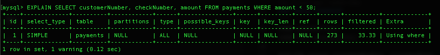
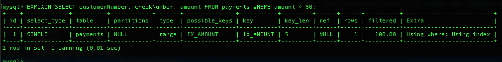

# Sql Optimization

Created by: Gustavo Morais

### Dicas
```
1- Stop bringing every column with *, pick your columns
2- Use very specific WHERE clauses
```

### Choose columns
```sql
SELECT u.name, u.email FROM users AS u WHERE u.id = 1;
```

### Debug Commands
```
SHOW processlist;
SHOW FULL processlist;

EXPLAIN select customerNumber, customerName, phone, city FROM customers LIMIT 10;
```

### Show details of query execution
The 'Show warnings' commad shows the query details
```
EXPLAIN extended select customerNumber, customerName, phone, city FROM customers LIMIT 10; SHOW warnings;
```


### Use indexes
Indexes creates a pointer in the table column that is used to split
the table for the data search, making it faster to look for the
data in the first half and the second half.
The engine needs to look for less rows to find the desired data.
```
ALTER TABLE payments ADD KEY IX_AMOUNT(amount);
EXPLAIN SELECT customerNumber, checkNumber, amount FROM payments WHERE amount < 50;
```

<br>
Here we can see that the engine finds the result by looking just one row.
<br>


### Show cost of last query execution
Use this command to measure if it costs less to run a lot of simple queries then just one complex query.
```
SHOW STATUS LIKE 'Last_Query_Cost';
```

### Debug Joins
To see the cost of the query join use the command [SHOW STATUS LIKE 'Last_Query_Cost'],
and to see the execution path with details use the [EXPLAIN EXTENDED] and the [SHOW WARNINGS;]
This is the way to see the better format of the join query
```
EXPLAIN EXTENDED SELECT * FROM offices AS f INNER JOIN employees AS e ON f.officeCode = e.officeCode WHERE f.officeCode = 1; SHOW WARNINGS;
SHOW STATUS LIKE 'Last_Query_Cost';
```

### Stress DB test
Stress test shows the real performance of a query.
```sql
delimiter // -- the delimiter changes the end instruction character [ delimiter [choosen character] ]
CREATE PROCEDURE SubQ(p1 INT)
BEGIN
    label1: LOOP
        SET p1 = p1 - 1;
        IF p1 > 0 THEN
                SELECT *
                FROM offices AS f
                INNER JOIN employees AS e ON f.officeCode = e.officeCode
                WHERE f.officeCode = 1;
            ITERATE label1;
        END IF;
        LEAVE label1;
    END LOOP label1;
END//
delimiter ; -- return the delimiter query to be ';'

CALL SubQ(1000);

DROP PROCEDURE SubQ;

SHOW STATUS LIKE 'Last_Query_Cost'; -- show cost of last query
```


