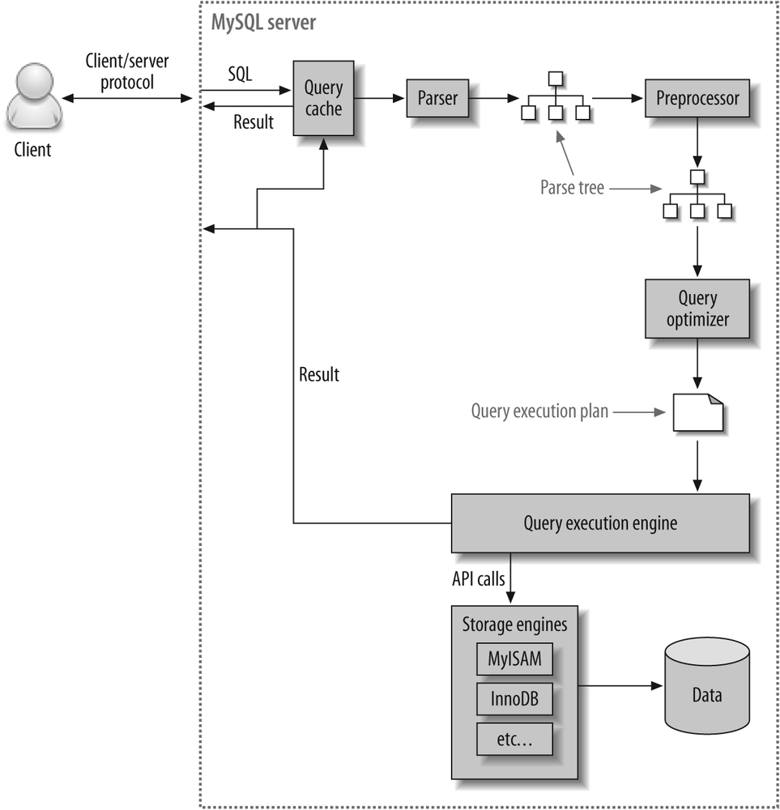

# Sql Optimization

Created by: Gustavo Morais

### Dicas
```
1- Stop bringing every column with *, pick your columns
2- Use very specific WHERE clauses
```

### Choose columns
```sql
SELECT u.name, u.email FROM users AS u WHERE u.id = 1;
```


