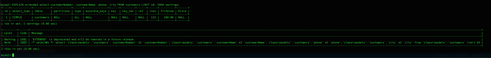

# Sql Optimization

Created by: Gustavo Morais

### Dicas
```
1- Stop bringing every column with *, pick your columns
2- Use very specific WHERE clauses
```

### Choose columns
```sql
SELECT u.name, u.email FROM users AS u WHERE u.id = 1;
```

### Debug Commands
```
SHOW processlist;
SHOW FULL processlist;

EXPLAIN select customerNumber, customerName, phone, city FROM customers LIMIT 10;
```

### Show details of query execution
The 'Show warnings' commad shows the query details
```
EXPLAIN extended select customerNumber, customerName, phone, city FROM customers LIMIT 10; SHOW warnings;
```



